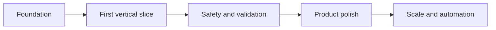

# Improvements for AMA2

This file is a practical roadmap for taking the project from a strong scaffold to a credible, demo-ready, and eventually production-ready system.

## Priority ladder

## Make it next level

### 1. Ship one end-to-end slice first

The biggest upgrade is not more features, it is a real workflow:

- upload dataset
- create session
- profile data
- infer problem type
- emit risk flags
- persist trace
- generate one report

Why this matters:

- It proves the architecture is executable.
- It exposes contract gaps immediately.
- It gives you a demo that is much more persuasive than a plan document.

### 2. Replace stubs with real agent behavior

The current agents are mostly placeholders. Each one should own a clear responsibility and write only to its own slice of state.

Suggested sequence:

- Data understanding: schema, missingness, duplicates, imbalance, outliers.
- Problem framing: target detection, task type, leakage checks, CV strategy.
- Risk failure: pre-training and post-training gate checks.
- Preprocessing: build an actual sklearn pipeline.
- Model strategy: select candidates and baselines.
- Training: run CV and record metrics.
- Evaluation: compare against baselines, slice analysis, calibration.
- Explainability: SHAP summary and representative examples.
- Report generation: render JSON, HTML, and PDF from trace data.

### 3. Add a test harness before adding more features

This project needs tests at three levels:

- Unit tests for each agent and helper.
- Integration tests for state transitions and repository behavior.
- End-to-end tests for the full dataset-to-report path.

High-value test targets:

- PipelineState invariants
- BaseAgent logging and failure handling
- risk flag emission
- graph retry routing
- approval gate resumption
- report regeneration from trace alone

### 4. Remove naming drift and contract ambiguity

There is already a small naming mismatch between plan and code, such as `risk_check` versus `risk_failure`. That kind of drift will create avoidable bugs later.

Do this now:

- choose one canonical name per agent
- align file names, factory keys, routes, and graph nodes
- add enum-like constants for node names and risk codes
- make the JSON contracts the source of truth

### 5. Harden configuration and security

The current config uses local defaults, which is fine for development but not for a serious deployment.

Upgrade this by:

- moving secrets to environment-only values
- validating required settings on startup
- separating dev, test, and prod config profiles
- adding upload limits and file validation
- keeping dataset ownership checks explicit in every request path

### 6. Add observability that helps debugging, not just logging

The project already leans toward traceability, so finish that idea properly.

Add:

- request IDs and session IDs everywhere
- structured logs with consistent fields
- pipeline metrics for stage timing and retries
- model-level metrics for CV, calibration, and drift
- a simple dashboard for failed runs and human approvals

### 7. Make the frontend feel like a product, not a placeholder

If this becomes a UI, it should emphasize:

- trace timelines
- approvals
- risk flags
- model comparison
- report viewing

The UI should make the system feel inspectable and trustworthy.

### 8. Split the roadmap into release tiers

Suggested release tiers:

| Tier | Goal | User value |
|---|---|---|
| v0.1 | One working pipeline slice | Proves the system exists |
| v0.2 | Human gates and trace timeline | Makes the system auditable |
| v0.3 | Report generation and export | Makes the system useful |
| v1.0 | Full workflow with tests and deployment | Makes the system credible |

## Impact versus effort

| Improvement | Impact | Effort | Why it is worth doing |
|---|---:|---:|---|
| One end-to-end slice | Very high | Medium | Turns the repo into a real demo |
| Replace agent stubs | Very high | High | Core product value depends on it |
| Add tests | Very high | Medium | Reduces regression risk immediately |
| Align naming and contracts | High | Low | Prevents future drift and confusion |
| Harden config | High | Low | Removes obvious deployment risk |
| Add observability | High | Medium | Speeds up debugging and trust |
| Improve frontend polish | Medium | Medium | Helps adoption and demo quality |

## What would make this feel premium

If you want the project to feel truly next level, aim for these qualities:

- every decision is explainable
- every gate is visible to the user
- every run is reproducible
- every report can be regenerated from trace data
- every failure points to a concrete next action

That combination turns the project from an AutoML prototype into an analysis platform.

## Recommended next implementation sprint

1. Implement data understanding and problem framing with real logic.
2. Add persistence for trace entries and risk flags.
3. Wire a simple pipeline run endpoint and status view.
4. Add one report format, then expand to HTML and PDF.
5. Add tests for the exact behaviors above.
