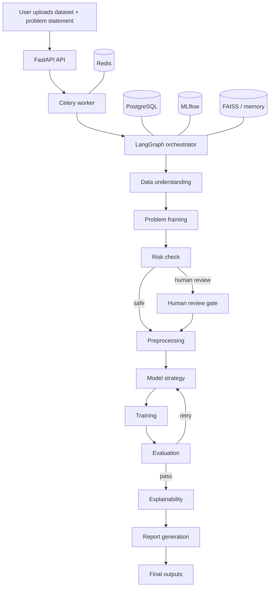

# AMA2 Adaptive ML Analyst Agent

AMA2 is a tabular-ML operations system designed to take a raw dataset and a plain-English problem statement, profile the data, infer the ML task, build preprocessing and model candidates, evaluate the result, generate explainable outputs, and preserve a full audit trail.

The current repository is a strong architecture scaffold with a detailed implementation plan, a backend contract layer, and a small amount of runtime code. It is not yet a complete production app, but it already defines the core shape of the system clearly.

## What this repo is trying to become

- A multi-agent workflow for data understanding, problem framing, risk checks, preprocessing, model selection, training, evaluation, explainability, and reporting.
- A safety-first pipeline with human approval gates for suspicious or high-risk situations.
- An auditable ML system with PostgreSQL persistence, MLflow tracking, and structured trace logs.
- A deployable FastAPI backend that can eventually power a UI for session review, approvals, and reports.

## Current repo state

What is already present in the checkout:

- A top-level implementation plan in [IMPLEMENTATION_PLAN.md](IMPLEMENTATION_PLAN.md) that describes the target architecture in detail.
- A task tracker in [TASK.md](TASK.md) showing the scaffold phase is complete and user review is next.
- Core backend contracts in [backend/app/core/pipeline_state.py](backend/app/core/pipeline_state.py), [backend/app/agents/base.py](backend/app/agents/base.py), [backend/app/core/agent_factory.py](backend/app/core/agent_factory.py), and [backend/app/db/models/models.py](backend/app/db/models/models.py).
- A minimal FastAPI app entrypoint in [backend/app/main.py](backend/app/main.py).
- Local configuration and repository helpers in [backend/app/config.py](backend/app/config.py) and [backend/app/db/repositories/generic.py](backend/app/db/repositories/generic.py).
- A dependency set in [pyproject.toml](pyproject.toml) that matches the intended stack: FastAPI, LangGraph, SQLAlchemy, Alembic, Redis, Celery, MLflow, scikit-learn, Optuna, SHAP, FAISS, structlog, and report generation tools.

What is still mostly scaffolded:

- The actual agent logic is mostly placeholder code.
- The FastAPI app only exposes a health endpoint right now.
- The orchestration graph, API routes, tests, and deployment assets are planned but not yet implemented in this checkout.

## System overview

## Scorecard

These scores reflect the checked-in code and docs, not the intended blueprint.

| Area | Score | Visual | Evidence | Notes |
|---|---:|---|---|---|
| Architecture vision | 9/10 | █████████░ | Implementation plan is unusually detailed | Strong design, but it needs a tighter release boundary |
| Backend foundation | 5/10 | █████░░░░░ | App entrypoint, config, DB base, ORM, repo helper | Good base, but runtime behavior is thin |
| Agent framework | 4/10 | ████░░░░░░ | BaseAgent exists, concrete agents are stubs | Needs real data and model logic |
| Data/ML pipeline | 2/10 | ██░░░░░░░░ | Contracts exist, workflow is not implemented | Training, evaluation, and explanation are pending |
| Persistence layer | 5/10 | █████░░░░░ | ORM models and generic repository are defined | Migrations, indexes, and tests are still missing |
| API surface | 2/10 | ██░░░░░░░░ | Only health check is present | Session, pipeline, approval, and report endpoints are planned |
| Testing readiness | 1/10 | █░░░░░░░░░ | No visible test suite in the checkout | This is the biggest risk to shipping safely |
| Operational readiness | 2/10 | ██░░░░░░░░ | Structured logging and env-based config exist | Needs secrets handling, observability, and deployment files |

Overall readiness: 4.0/10

Interpretation: the project has a strong blueprint and a credible internal contract design, but it is still early in implementation. It is best viewed as a platform skeleton rather than a finished product.

## What the current code already gets right

- The central state object is explicit and typed in [backend/app/core/pipeline_state.py](backend/app/core/pipeline_state.py).
- The base agent abstraction already provides a consistent execution and logging pattern in [backend/app/agents/base.py](backend/app/agents/base.py).
- The ORM schema includes the main audit entities: sessions, agent decisions, model runs, risk flags, and human approvals.
- The implementation plan is clear about the non-negotiables: typed agent handoffs, human gates, retry routing, traceability, and model evaluation discipline.

## Biggest gaps to close

1. Implement the actual agent logic instead of placeholder methods.
2. Wire the LangGraph orchestration path end to end.
3. Add API endpoints for sessions, pipeline runs, approvals, traces, and reports.
4. Add migrations, indexes, and repository tests for the database layer.
5. Add a real unit/integration/e2e test suite before expanding the surface area.
6. Replace local dev defaults in config with safer environment validation.

## Recommended first milestone

The best next milestone is a single working vertical slice:

1. Create a session.
2. Upload one CSV.
3. Run data understanding and problem framing.
4. Emit risk flags and a trace.
5. Persist everything to PostgreSQL.
6. Render one basic report.

Once that path works, the rest of the roadmap becomes much easier to validate.

## Local setup

The repo currently defines the dependencies, but the implementation is not yet a finished runnable product. Once the package entrypoints and missing runtime pieces are in place, the intended stack is Python 3.10+, FastAPI, PostgreSQL, Redis, Celery, and MLflow.

## Key files

- [README](README.md)
- [Implementation plan](IMPLEMENTATION_PLAN.md)
- [Task tracker](TASK.md)
- [FastAPI entrypoint](backend/app/main.py)
- [Pipeline state contract](backend/app/core/pipeline_state.py)
- [Base agent abstraction](backend/app/agents/base.py)
- [Database models](backend/app/db/models/models.py)
- [Project dependencies](pyproject.toml)
